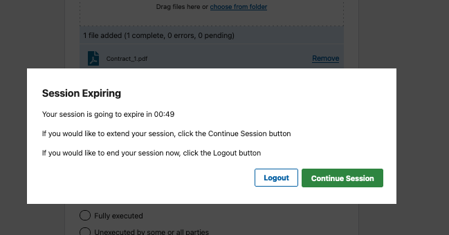

# Feature brief: Session Expiration

## Introduction

We use a third-party authentication provider ([IDM](https://confluenceent.cms.gov/display/IDM/IDM+Trainings+and+Guides)) which automatically logs out sessions due to inactivity after about 30 minutes. Although MC-Review user sessions are handled by AWS Amplify/Cognito after login, we follow the same rules. We currently don't access Cognito to check if our session is active. Instead, we manually track sessions internally in state via [`react-idle-timer`](https://idletimer.dev/). This also allows us to follow the CMS Acceptable Risk Safeguards(ARS) controls `AC-11 Idle Session Timeout` and `AC-12(03) Timeout Warning Message`.

The session timeout duration is also permanently feature-flagged since we have different requirements between production/staging and lower environments. More details about feature flags [below](#implementation-details).

## Expected behavior
 Two minutes before the session will expire due to inactivity we show a warning modal. The modal displays a live countdown and has CTA buttons with 1. the ability to log out immediately 2. the ability to extend the session. This helps us fulfill accessibility requirements around [WCAG 2.2.1 Timing Adjustable](https://www.w3.org/WAI/WCAG21/Understanding/timing-adjustable.html).

### Possible outcomes after the session expiration modal is displayed:
1. If the user chooses to logout, we redirect to landing page.
2. If the user extends the session, we refresh their tokens and restart our counter for the session.
3. If the user takes no action and the browser is still active, the countdown completes and the user is automatically logged out and redirected to landing page. A session expired banner notifies them what happened.

This auto logout behavior will happen even if the browser tab is in the background. Either way we are keep track of time and the session expiration flow will work as expected.

## Known edge cases
These are edge cases we decided not to address. Documenting for visibility.

- The user puts computer to sleep while logged in (before session expiration modal is visible) and comes back after the session has expired.
    - In this case, the session expiration modal will not display. The user will still appear logged in when they relaunch their computer and browser. However, as soon as the user takes an action that hits the graphql API or tries to upload a file to S3, we will follow the code path for outcome #3 above - logout the user, redirect to landing page, show session expired error banner.
- The user has MC-Review open in multiple tabs and then logs out of only one tab manually before session expiration.
    - This is not an ideal user experience. This is why we recommend users navigate the application in one tab at time. If the user logs out then goes to another tab that is still open and starts using the application, they will be able to make some requests with the cached user but at a certain point the requests will error (this may or may not be auth errors, sometimes the API may fail first with 400s and thus the generic failed request banner will show)

##  Implementation details
- There are two evergreen feature flags (`SESSION_EXPIRING_MODAL` and `MINUTES_UNTIL_SESSION_EXPIRES`) associated with this feature.
    -  `SESSION_EXPIRING_MODAL` allows turning this feature off on dev and review apps since it can disrupt Cypress.  Expect that VAL and PROD have this flag turned on permanently.
    - `MINUTES_UNTIL_SESSION_EXPIRES` allows us shorten the session expiration time to turn on modal quickly and test functionality. Expect that VAL and PROD the default 30 min is used.
- Primary logic for the feature is found in `AuthContext.tsx`
    - `MODAL_COUNTDOWN_DURATION` is the hard-coded constant that holds the amount of time the modal will be visible prior to logout for inactivity. It is set to 2 minutes.
    - use of `session-timeout`query param to ensure error banner displays
