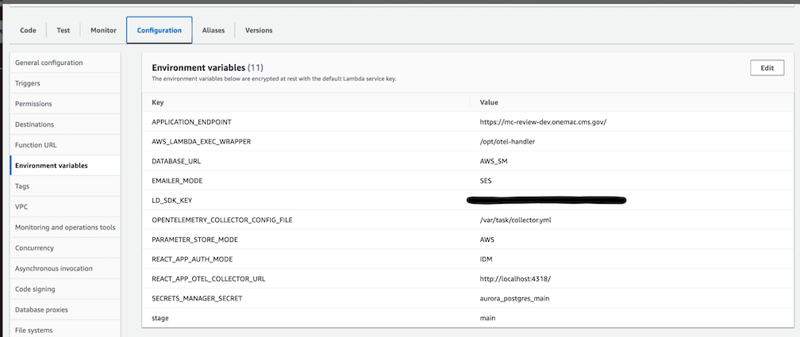

# How to complete migrations

## Background

Migrations are a controlled way to change existing records in the database or else change the shape of tables/relationships. They are necessary when fields are added, removed, or when the meaning behind fields and their relationships change.

## Schema Migrations

Schema migrations are changes to the database models and relationships.

We use Prisma to perform schema migrations. Right now the developer process for schema migrations is described a bit [here](../../README.md#updating-the-database). More detailed steps forthcoming.

## Data Migrations

Data migrations change existing records in the database. Here are steps to prepare for a data migration.

1. Define clear acceptance criteria and QA steps early
    - How do you know migration applied?
    - What will be checked either in the app, via api request, or in the reports CSV?
    - Developers may have to verify that the change worked multiple timesas migration through different environments.

1. Prepare for manual testing in lower environments.
    - Build a PR review app off `main` to start out to get Cypress running.
    - Prepare local environment by [dumping VAL database](#how-to-dump-val-data-for-local-testing) and relying on that for local runs.

1. Write a migration script that includes verbose logs.
    - Console statements are essential because there are line numbers in Cloudwatch when the migration fails or does not apply correctly. There is little additional context about why a run execution paused or failed.
    - Here is an example of verbose debug console statements wrapping a loop:
      

### Data migration via `app-api` tooling **recommended option for data migrations*

We now have tooling for data migrations in `app-api/src/dataMigrations`. These are JS scripts that can use Prisma functions, be tested locally, and then run sequentially on higher environment databases.

🚩 More detailed steps forthcoming.

### Migration via AWS Lambda
This type of migration is run as standalone lambda that developers must manually trigger by environment. They can be prototyped for fast feedback in the local environment, and then tested more thoroughly in lower environments.

#### Local prototyping for AWS lambda

1. Log into the AWS console (you'll need to be connected to the CMS VPN).
1. Go to the Dev environment dropdown: Cloud Access Roles --> Developer Admin --> Short-term Access Keys.
1. Choose option 1, and copy those values to the clipboard.
1. Paste the values into your .envrc.local file. Be sure that you're overwriting any previous values, and don't have duplicates.
1. If the app is running anywhere, stop it.
1. Run `DIRENV ALLOW` in the terminal in the directory where you'll start the app.
1. Start the app.
1. When the app is running, connect to the local database so that you can inspect the changes you're making. Use the DATABASE_URL from your .envrc.local file to connect to the database interface of your choice. You can connect via the terminal, or an app like TablePlus, dBeaver, Postico, DataGrip, etc.
1. Run some Cypress tests to populate the database. The CMSWorkflow tests are a good choice, since they create two entries which contain rates, one of which has a revision.
1. Verify that in the local database you can see entries in the HealthPlanPackageTable and HealthPlanRevisionTable.
1. Now you're ready to run your lambda. In a different terminal instance, run `DIRENV ALLOW` again.
1. Navigate to `services/app-api`.
1. Run `npx serverless invoke local --function `name_of_your_lambda``. You should see it build with webpack, then run. Any log statements you've put in your code will display in this window.
1. You can inspect the database again and should see any changes or additions you've made.

#### Running in a lower environment for AWS lambda

1. Manually test the migration in your review app.
    - Log into [AWS Lambda Console](https://console.aws.amazon.com/lambda/home) and find the lambda. This means choosing `app-api-` lambda with your branch name and migration name included.
    - Click the Test tab and the `Test` button. Use the generic hello world event.
        - All output will appear inline on the same page as the lambda run. All consoles appear there as well. You can also click into a link from there into Cloudwatch to be able to see the entire output of logs around the lambda execution.
    - If you need to debug quickly, without waiting for redeploy in review app use the severless CLI script.
        - `serverless deploy function --function name_of_migration --stage my_branch && echo "DEPLOYED" && serverless logs --function name_of_migration  --stage my_branch --tail` can be run in your `app-api` directory. This script deploys your local handler code directly to AWS, without going through our normal CI build process. `my_branch`is the name of your deployed Github branch and `name_of_migration` is the name of the migration file mind the file path.
        - If this is to be run in DEV (`main`) you will have to reshape your `envrc.local` to imitate configuration on that stage. See AWS console for Lambda to reference the shape of config.
          
        - Command line serverless scripts should not be used on PROD. Ideally do not use in VAL either. Running a migration via the AWS lambda console web interface is preferred because it is guaranteed to build off merged code and use similar configuration to how our application is deployed in CI.
1. After the PR merges and promotes,run in higher environments.
    - Start with DEV. Follow similar steps Step #4 but now using the `main` lambda for your migration.
    - Run the migration DEV > VAL > PROD in order, verifying in the application (or via reporting output) after each run.

## How to dump VAL data for local testing

1. use `./dev jumpbox clone val` to clone the val database to your local machine

2. Load that db dump into your local running postgres instance
    - `pg_restore -h localhost -p 5432 -U postgres -d postgres --clean val-[date].sqlfc`. You will be promoted to enter in local db password `shhhsecret`. You will see print out errors but the database has spun up successfully.
